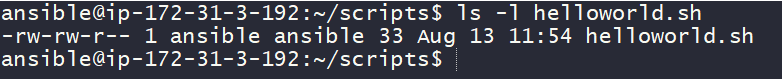

### Tools we will be using to write bash scripts
* Visual Studio Code
* Gt Bash (Windows)/ Terminal (Other Systems)
* Redhat Family & Ubuntu
* How to install [Refer Here](https://www.youtube.com/watch?v=mRILfUNbsIo)
* For creating Virtual Machines [Refer Here](https://www.youtube.com/watch?v=me2s3mTNwGo&list=PLuVH8Jaq3mLszrC7lv68a0VcrDripW-HK&index=2)

### Hello World
* Lets create a new file called as _helloworld.sh_ and inside this
```bash
#!/bin/bash
echo "Hello World!"
```
* Now Lets execute the script using  ```bash helloworld.sh```
  


* Generally all the shell scripts will have extensions of _.sh_
* What is ```#!/bin/bash?```
  * It is called _shebang_
  * It tells the linux system which binary to use to execute the script
  * For example if you were writing python code the shebang might be ```#!/usr/bin/python3```
  * Since we are executing shell scripts on bash prompt our shebang is ```#!/bin/bash```

* To execute the program we have used _bash_ command. If i have a shebang which already tells where the executable is still why do i need bash?
* Remember file permissions in linux (RWX) to execute scripts we need execute permissions, so lets check whats the permission which we have
  


* Now lets add execute permissions and run the script


### Readability
* When writing scripts, aim to make sure the code is as readable as possible.
* How to make scripts readable?
  * Comments
  * Verbosity

* Comments:
  * Comments is nothing more than bit of text explaining what you are doing.
  * n shell the character which we use to denote comments is #
  * So lets add comments
  * Approach 1:
  
```bash
#!/bin/bash

# Print the text to the terminal
echo "Hello World!"
```

  * Approach 2:
```bash
#!/bin/bash

echo "Hello World!" # Print the text to the terminal
```

* Its often a good practice to have script header with fields like
  * Author
  * Version
  * Date
  * Description
  * Usage
* Script headers and Comments make your scripts more professional

```bash
#!/bin/bash

##########################################################################################
# Author        : Shaik Khaja Ibrahim
# Version       : v1.0.0
# Date          : 13-August 2020 
# Description   : This is first Shell Script
# Usage         : ./helloworld.sh
##########################################################################################

echo "Hello World!" # Print the text to the terminal
```

* Verbosity:
  *   Verbosity is the balancing act between not too much but also not less explanation.
  * Lets discuss three types of verbosity
    * Verbosity in Comments:
      * Ensure your comments are punctual and smaller.
    * Verbosity in Commands:
      * Try to use long variant in commands as shown in the below example with ```ls -R``` & ```ls --recursive```. Both give same results but long variant is readable
      

* Verbosity in Command Otputs:
  * Always try to build scripts which take two argument -v/–verbose and -q/–quiet. When user runs your script with verbose parameter give detailed information about what is happening & in other case don’t display anything or display only absolutely required stuff to the terminal.

* Shell script is a sequence of linux commands that are to be executed in an order.