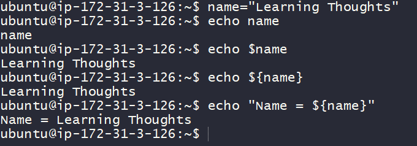
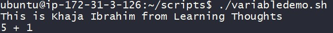
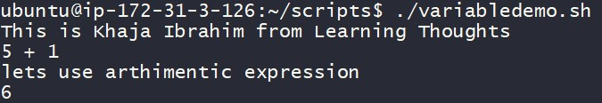
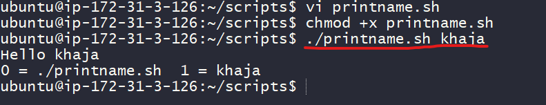

### Variables and User Input

#### What is a Variable?
* Variable is a standard building block in scripting languages, They allow you to store information, so that we can retrieve/change multiple times during the execution of script.
* Assigning the value variable ```<variable_name>=<variable_value>```

```bash
name="Learning Thoughts"
```

* Referencing the variable ```${variable_name}``` or ```$variable_name```

```bash
echo $name
echo ${name}
echo "Name == ${name}"
```



* Now lets try to create a simple shell script
  
```bash
#####################################################################
# Author: Shaik Khaja Ibrahim
# Version: v1.0.0
# Date: 25-Aug-2020
# Description: This is shell script demonstrating variables
# Usage: ./variabledemo.sh
#####################################################################

name="Khaja Ibrahim"
org_name="Learning Thoughts"

# Here we are interpolating the variables
echo "This is ${name} from ${org_name}"

# All the variables are treated as text by linux until and unless you are explicit
number=5
echo $number + 1
```

* Now execute the script



* Now shell script is treating numbers as text, if we want shell script to consider variable number as integer, we need to use and expression

```bash
$(( ${number} + 1 ))
```
* Now considering the script to be
```bash
#!/bin/bash

#####################################################################
# Author: Shaik Khaja Ibrahim
# Version: v1.0.0
# Date: 25-Aug-2020
# Description: This is shell script demonstrating variables
# Usage: ./variabledemo.sh
#####################################################################

name="Khaja Ibrahim"
org_name="Learning Thoughts"

# Here we are interpolating the variables
echo "This is ${name} from ${org_name}"

# All the variables are treated as text by linux until and unless you are explicit
number=5
echo $number + 1

echo "lets use arthimetic expression"
echo $(( ${number} + 1 ))
```



* In shell scripting we following naming conventions, for
  * variables: lowercase with underscores
  ```bash
    my_number=6
    message="how are you"
  ```
  * Constants: UPPERCASE
  ```bash
    LOCATION="/home"
  ```
  * Do not create variables with names which already have some meaning PATH, USER, LANG, SHELL, HOME & so on. If the Purpose is similar try to prefix SCRIPT_, for example define as shown below.
  ```bash
    SCRIPT_PATH over PATH
    SCRIPT_USER over USER
  ```
  * So far, we have been dealing with static scripts, so let’s introduce the concept of user inputs in shell scripting

### Basic Inputs
* At a very basic level, everything you enter on the command line after the script can be used as input
```bash
./<script>.sh Hello
```
* Lets create a script called as printname.sh with the following script

```bash
#!/bin/bash

#####################################################################
# Author: Shaik Khaja Ibrahim
# Version: v1.0.0
# Date: 25-Aug-2020
# Description: This script demonstrates basic user inputs
# Usage: ./printname.sh <pass name>
#####################################################################
name=${1}
echo "Hello ${name}"

echo "0 = ${0}  1 = ${1}"
```

* Now execute the script



* Here ${1} stands for the _first positional argument_
* Generally we will have two kinds of arguments
    * Positional arguments
    ```
    cp 1.txt 2.txt # 1.txt & 2.txt are two positional arguments
    ```
    * Named arguments
    ```
    ping --count 4 google.com
    # google.com is a positional argument
    # where as 4 is a named argument as it value for a name called as count
    ```
* The script shown above is depending on positional arguments.