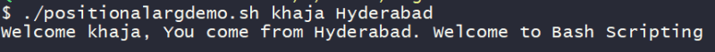
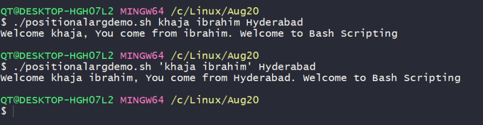
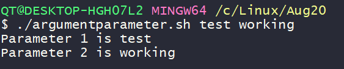
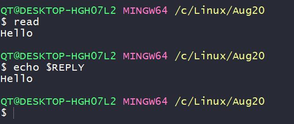
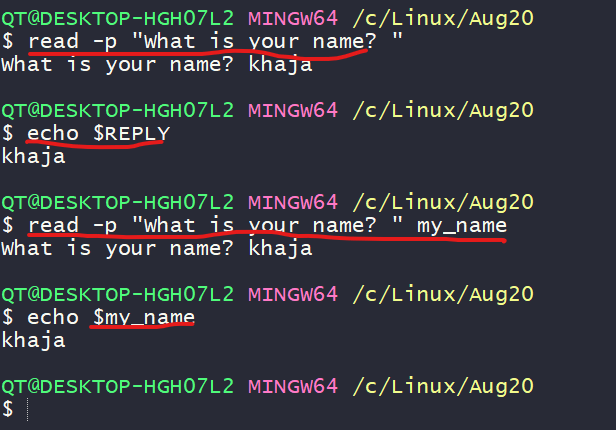
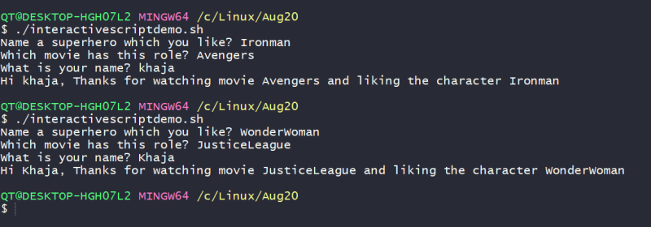

### Positional arguments in shell scripts
* The arguments which are passed to the shell script after the filepath of shell becomes positional arguments
```bash
./myscript.sh 12 13
```
* The above example consider
```bash
$0 = ./myscript.sh
$1 = 12
$2 = 13
```
* Lets develop a shell script which takes name and location as positional argument 1 and 2 and prints the message
```bash
#!/bin/bash

#####################################################################
# Author: Shaik Khaja Ibrahim
# Version: v1.0.0
# Date: 26-Aug-2020
# Description: This script demonstrates positional arguments
# Usage: ./positionalargdemo.sh <name> <location>
# 1 positional argument is considered as name
# 2 positional argument is considered as location
#####################################################################

name=$1
location=$2

echo "Welcome ${name}, You come from ${location}. Welcome to Bash Scripting"
```
* Execution Result




### Parameters & arguments
* Lets understand the terminology of parameter & arguments. They are slightly different
* Argument is something which you pass to a script.
* What you define in a script to hold argument value is parameter
* Lets write a simple script to demonstrate the difference

```bash
#!/bin/bash

#####################################################################
# Author: Shaik Khaja Ibrahim
# Version: v1.0.0
# Date: 25-Aug-2020
# Description: This is shell script demonstrating parameters and arguments
# Usage: ./argumentparameter.sh <arg-1> <arg-2>
#####################################################################

# parameter is used to define argument value
parameter_1=$1 # Here $1 is an argument

parameter_2=$2 # Here $2 is an argument

echo "Parameter 1 is ${parameter_1}" # Here ${parameter_1} is an parameter

echo "Parameter 2 is ${parameter_2}" # Here ${parameter_2} is an parameter
```



* The scripts which we have developed so far are non-interactive scripts, because once you pass the values the execution happens
* Interactive scripts take inputs from users while executing
* Now lets look at a simple _read_ command which reads the input from the user and stores in a variable called as REPLY



* Now lets execute one more simple variation of the _read_ command



* Lets build some interactive script asking questions to the user

```bash
#!/bin/bash

#####################################################################
# Author: Shaik Khaja Ibrahim
# Version: v1.0.0
# Date: 26-Aug-2020
# Description: This is shell script demonstrating interactive scripts
# Usage: ./interactivescriptdemo.sh
#####################################################################

read -p "Name a superhero which you like? " super_hero
read -p "Which movie has this role? " movie_super_hero
read -p "What is your name? " name
echo "Hi ${name}, Thanks for watching movie ${movie_super_hero} and liking the character ${super_hero}"
```

* Now lets execute the script



* Lets try to come up with script design which acts as a calculator by taking two values and operation as input?
  * Script will be _calculator.sh_
  * operations that will be supported are _add,sub,mul,div_
  * It should take two numbers to perform math.