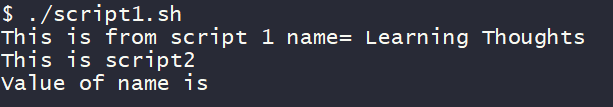

### Variable Scopes in Shell scripts

* Lets create two shell scripts
  * script1.sh
    ```bash
    #!/bin/bash

    name="Learning Thoughts"
    echo "This is from script 1 name= ${name}"
    ./script2.sh
    ```
  * script2.sh
    ```bash
    #!/bin/bash

    echo "This is script2"
    echo "Value of name is ${name}"
    ```

* From script1 lets call script2 and try to see if the variable defined in script1 is available for use in script2
* lets execute script1.sh



* The value of name is not available in script2. The default scope of variable is the same script file.
* So lets find out if there is any other way to pass the variable from script1 to external scripts,
  1. add Arguments to script2
```bash
./script2.sh 
# replace this with
./script2.sh $name
```
  2. export the variable using export statement in script1. so lets change script1.sh
```bash
#!/bin/bash

name="Learning Thoughts"
echo "This is from script 1 name= ${name}"
export name
./script2.sh
```


### Debugging your scripts

